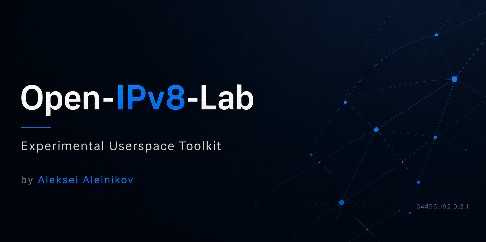

# Open-IPv8-Lab

<p align="center">
  
</p>

[](LICENSE)
[](https://spdx.org/licenses/Apache-2.0.html)
[](https://github.com/LF3551/Open-IPv8-Lab/actions/workflows/tests.yml)

Open-IPv8-Lab is an experimental userspace toolkit implementing [draft-thain-ipv8-00](https://www.ietf.org/archive/id/draft-thain-ipv8-00.html) — the Internet Protocol Version 8 specification. It covers ASN-based 64-bit addressing, packet encoding/decoding, two-tier routing, ICMPv8, 8to4 tunnelling, security filtering, VRF, PVRST, Cost Factor, WHOIS8, DHCP8, Zone Server (OAuth8/ACL8), NetLog8 telemetry, all companion spec modules, end-to-end integration scenarios, multi-zone simulation, BGP8 path selection with CF metric, XLATE8 north-south traffic flow, PCAP export for Wireshark integration, IPv8 packet fragmentation and reassembly, and interactive Zone Server CLI.

Created and maintained by Aleksei Aleinikov ([@LF3551](https://github.com/LF3551)).

## Status

> **This project is experimental and educational.** It is not an official IPv8 implementation, not production networking software.

## Spec coverage (draft-thain-ipv8-00)

| Section | Topic | Module |
|---------|-------|--------|
| 1.3 | DHCP8 lease (single-response provisioning) | `dhcp8.py` |
| 1.3 | Zone Server (OAuth8 cache, ACL8 engine) | `zoneserver.py` |
| 1.4 | East-west / north-south security | `zoneserver.py` |
| 1.6 | Cost Factor (CF) metric simulation | `cost_factor.py` |
| 3 | Address format (64-bit, ASN prefix + host) | `address.py` |
| 4 | Address classes (unicast, multicast, broadcast, RINE, internal zone) | `address.py` |
| 5.1 | Packet header (28-byte, version 8) | `packet.py` |
| 6 | ASN dot notation | `address.py` |
| 7 | DNS A8 record (even/odd pair, RFC 1918 validation) | `dns_a8.py` |
| 8.7 | Two-tier routing table | `route.py` |
| 8.8 | VRF (management VLAN 4090, OOB VLAN 4091) | `vrf.py` |
| 9 | ICMPv8 (Echo, Unreachable, Redirect, Time Exceeded) | `icmpv8.py` |
| 10–12 | Multicast, anycast, broadcast | `multicast.py` |
| 13.3 | 8to4 tunnelling | `tunnel.py` |
| 17.1–17.3 | Device compliance tiers | `compliance.py` |
| 17.4 | PVRST (Zone Server root election) | `pvrst.py` |
| 17.5 | NIC rate limits | `ratelimit.py` |
| 18 | Security — ingress filtering, prefix protection | `security.py`, `validation.py` |
| 18 | NetLog8 telemetry (SEC-ALERT, E3 traps) | `netlog8.py` |
| — | WHOIS8 mock resolver (ASN/route validation) | `whois8.py` |
| — | Companion specs (BGP8, OSPF8, IS-IS8, RINE, ARP8, XLATE8, Update8, WiFi8, SNMPv8) | `companions.py` |
| — | End-to-end integration (DHCP8 → OAuth8 → ACL8 → routing) | `integration.py` |
| — | Multi-zone simulation (Zone Server pairs, IBGP8 inter-zone routing) | `multizone.py` |
| 8.4 | BGP8 path selection with CF metric (anomaly detection, failover) | `bgp8_selection.py` |
| 1.4 | XLATE8 north-south traffic flow (DNS8 → XLATE8 → translation) | `xlate8_flow.py` |
| — | PCAP export for Wireshark integration (PcapWriter, PcapReader, Lua dissector) | `pcap_export.py` |
| 5.1 | IPv8 packet fragmentation and reassembly (DF/MF flags, offset, Reassembler) | `fragmentation.py` |
| — | Interactive Zone Server CLI | `cli/zone_cli.py` |

## Goals

- Parse and validate IPv8 64-bit addresses (Section 3)
- Classify address types: unicast, multicast, broadcast, RINE, internal zone (Section 4)
- Build and parse spec-compliant IPv8 packets (Section 5.1)
- Two-tier routing simulation with VRF support (Sections 8.7, 8.8)
- ICMPv8 messages: Echo, Destination Unreachable, Redirect (Section 9)
- 8to4 tunnelling for IPv8-over-IPv4 transit (Section 13.3)
- DNS A8 record parsing with even/odd pair convention (Section 7)
- Device compliance tier validation (Sections 17.1–17.3)
- PVRST Zone Server root election (Section 17.4)
- NIC firmware rate limiting simulation (Section 17.5)
- Border router ingress filtering and security checks (Section 18)
- Cost Factor (CF) metric: 7-component path quality with physics floor (Section 1.6)
- WHOIS8 route/destination validation
- DHCP8 single-response lease provisioning (Section 1.3)
- Zone Server OAuth8 JWT cache and ACL8 access control (Sections 1.3, 1.4)
- NetLog8 telemetry with SEC-ALERT and E3 traps (Section 18)
- Companion spec modules: BGP8, OSPF8, IS-IS8, RINE, ARP8, XLATE8, Update8, WiFi8, SNMPv8
- End-to-end integration scenario: DHCP8 → OAuth8 → ACL8 → routing lifecycle
- Multi-zone simulation with Zone Server pairs and IBGP8-style inter-zone routing
- BGP8 path selection with CF metric: per-prefix RIB, anomaly detection, failover
- XLATE8 north-south traffic flow: DNS8 → XLATE8 → address translation (Section 1.4)
- PCAP export for Wireshark integration: PcapWriter, PcapReader, Lua dissector
- IPv8 packet fragmentation and reassembly: DF/MF flags, fragment offset, stateful Reassembler
- Interactive Zone Server CLI: `ipv8lab zone` (init, status, services, ACL8, OAuth8, VLAN)
- Mesh network simulation, packet capture, web dashboard, benchmarks, plugins

## Non-goals

- No Linux kernel modifications
- No production networking
- No real BGP integration
- No claim of official IETF endorsement

## Installation

```bash
python -m venv .venv
source .venv/bin/activate
pip install -e ".[dev]"
```

## Quick start

```bash
# Parse an IPv8 address
ipv8lab addr parse 64496.192.0.2.1

# Convert ASN to routing prefix
ipv8lab addr encode-asn 64496

# Decode prefix back to ASN
ipv8lab addr decode-prefix 0.0.251.240

# Build a packet
ipv8lab packet build --src 64496.192.0.2.1 --dst 64497.198.51.100.7 --payload "hello"

# Parse a packet from file
ipv8lab packet parse packet.bin

# Run routing simulation
ipv8lab route simulate --config examples/two_asn_demo.yaml

# Zone Server management
ipv8lab zone init --prefix 127.1.0.0
ipv8lab zone status
ipv8lab zone acl-add "*" gateway --action permit
ipv8lab zone oauth-issue device-42
ipv8lab zone vlan-check 100

# PCAP export for Wireshark
ipv8lab pcap demo -o demo.pcap
ipv8lab pcap inspect demo.pcap
ipv8lab pcap dissector -o ipv8_dissector.lua
ipv8lab pcap export trace.iv8cap trace.pcap
```

## Example output

```
ipv8lab addr parse 64496.192.0.2.1

Input                64496.192.0.2.1
Format               ASN dot notation
ASN                  64496
Routing prefix       0.0.251.240
Host part            192.0.2.1
Full notation        0.0.251.240.192.0.2.1
```

## Testing

```bash
pytest -v
```

1220 tests covering all implemented spec sections.

## Project structure

```
src/ipv8lab/
├── address.py        # IPv8 64-bit addressing (Section 3, 4, 6)
├── packet.py         # Packet header (Section 5.1)
├── checksum.py       # CRC32 checksum
├── route.py          # Two-tier routing (Section 8.7)
├── vrf.py            # Virtual Routing & Forwarding (Section 8.8)
├── icmpv8.py         # ICMPv8 protocol (Section 9)
├── multicast.py      # Multicast/broadcast (Sections 10–12)
├── tunnel.py         # 8to4 tunnelling (Section 13.3)
├── dns_a8.py         # DNS A8 records (Section 7)
├── compliance.py     # Device compliance tiers (Sections 17.1–17.3)
├── pvrst.py          # PVRST spanning tree (Section 17.4)
├── ratelimit.py      # NIC rate limits (Section 17.5)
├── security.py       # Ingress filtering (Section 18)
├── validation.py     # Prefix validation (Sections 3.5, 3.9, 3.10)
├── cost_factor.py    # Cost Factor (CF) metric (Section 1.6)
├── whois8.py         # WHOIS8 mock resolver
├── dhcp8.py          # DHCP8 lease simulation (Section 1.3)
├── zoneserver.py     # Zone Server: OAuth8 cache, ACL8 (Sections 1.3, 1.4)
├── netlog8.py        # NetLog8 telemetry client (Section 18)
├── companions.py     # Companion spec modules (7 companion drafts)
├── integration.py    # End-to-end integration scenario
├── multizone.py      # Multi-zone simulation with Zone Server pairs
├── bgp8_selection.py # BGP8 path selection with CF metric
├── xlate8_flow.py    # XLATE8 north-south traffic flow
├── pcap_export.py    # PCAP export for Wireshark (.pcap, Lua dissector)
├── fragmentation.py  # Packet fragmentation and reassembly
├── cf_dashboard.py   # CF performance dashboard (HTML, JSON API)
├── errors.py         # Error hierarchy
├── node.py           # Node abstraction
├── simulator.py      # Mesh network simulator
├── transport.py      # UDP transport
├── udp_runner.py     # Async UDP node orchestration
├── capture.py        # Packet capture (.iv8cap)
├── dashboard.py      # Web dashboard
├── benchmark.py      # Performance benchmarks
├── plugin.py         # Plugin system
├── dump.py           # Hex dump & JSON output
└── cli/              # Typer CLI commands
```

## Documentation

- [Overview](docs/overview.md)
- [Addressing](docs/addressing.md)
- [Packet format](docs/packet-format.md)
- [Routing simulator](docs/routing-simulator.md)
- [Testbed](docs/testbed.md)
- [Roadmap](docs/roadmap.md)

## License

This project is licensed under the [Apache License 2.0](LICENSE).

SPDX-License-Identifier: `Apache-2.0`

## Attribution

Use, modification, and distribution are permitted under the Apache License 2.0,
provided that the following conditions are met:

- The original copyright notice and license text must be preserved in all copies or substantial portions of the software.
- The [NOTICE](NOTICE) file must be included in any redistribution.
- Attribution to the original author — **Aleksei Aleinikov** ([@LF3551](https://github.com/LF3551)) — must remain intact.

If you use this project in your own work, please credit:

```
IPv8 Lab — Copyright 2026 Aleksei Aleinikov
https://github.com/LF3551/Open-IPv8-Lab
```
